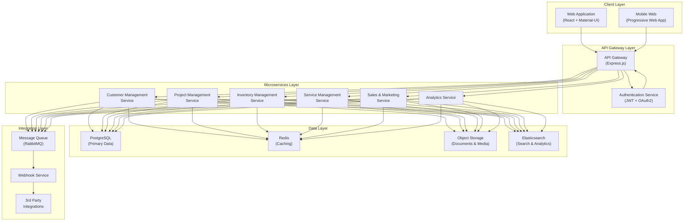
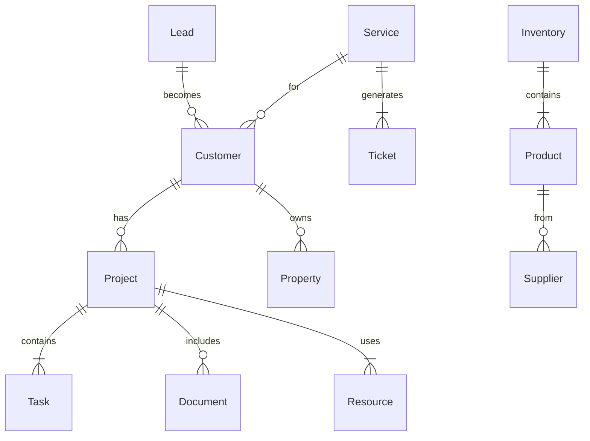
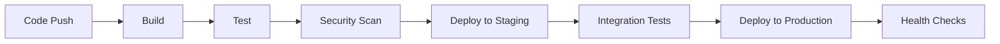

# Smart Home Integrators CRM - Technical Architecture Document

## 1. System Overview

### 1.1 Architecture Principles
- Microservices-based architecture
- Event-driven communication
- Domain-driven design
- Cloud-native implementation
- Security by design
- Scalability and high availability

### 1.2 High-Level Architecture Diagram

## 2. Component Architecture

### 2.1 Frontend Architecture

#### 2.1.1 Web Application
- **Framework**: React 18+
- **State Management**: Redux Toolkit
- **UI Components**: Material-UI v5
- **Build Tool**: Vite
- **Key Libraries**:
  - React Query (data fetching)
  - React Router (routing)
  - React Hook Form (form management)
  - date-fns (date manipulation)
  - recharts (data visualization)

#### 2.1.2 Progressive Web App
- Service Workers for offline capability
- App manifest for installation
- Responsive design breakpoints
- Client-side caching strategy
- Push notification support

### 2.2 Backend Architecture

#### 2.2.1 API Gateway
- Express.js framework
- JWT authentication
- Rate limiting
- Request validation
- Response caching
- API documentation (OpenAPI)
- CORS configuration
- Request logging

#### 2.2.2 Microservices

##### Customer Management Service
- Customer profile CRUD
- Communication history
- Document management
- Property management
- Contact preferences

##### Project Management Service
- Project CRUD
- Resource allocation
- Timeline management
- Task tracking
- Progress monitoring
- File attachments

##### Inventory Management Service
- Product catalog
- Stock management
- Order processing
- Supplier management
- Inventory analytics

##### Service Management Service
- Ticket management
- SLA monitoring
- Maintenance scheduling
- Service history
- Warranty tracking

##### Sales & Marketing Service
- Lead management
- Quote generation
- Pipeline tracking
- Campaign management
- Revenue forecasting

##### Analytics Service
- Data aggregation
- Report generation
- Dashboard metrics
- Data export
- Trend analysis

### 2.3 Data Architecture

#### 2.3.1 Database Schema

#### 2.3.2 Data Storage Solutions

##### PostgreSQL
- Primary data store
- Separate databases per service
- Partitioning for large tables
- Regular backups
- Replication for HA

##### Redis
- Session management
- API response caching
- Real-time counters
- Rate limiting
- Pub/sub messaging

##### Object Storage (S3)
- Document storage
- Media files
- Backup archives
- Temporary files
- Public assets

##### Elasticsearch
- Full-text search
- Analytics data
- Audit logs
- Performance metrics
- Error tracking

### 2.4 Integration Architecture

#### 2.4.1 Message Queue
- RabbitMQ for async communication
- Dead letter queues
- Message persistence
- Queue monitoring
- Retry mechanisms

#### 2.4.2 External Integrations
- RESTful APIs
- Webhook support
- OAuth2 authentication
- Rate limiting
- Circuit breakers

## 3. Security Architecture

### 3.1 Authentication
- JWT-based authentication
- OAuth2 for SSO
- 2FA support
- Password policies
- Session management

### 3.2 Authorization
- Role-based access control
- Resource-level permissions
- API scope control
- Token validation
- Audit logging

### 3.3 Data Security
- TLS 1.3 encryption
- Data encryption at rest
- Key management
- Regular security audits
- Vulnerability scanning

## 4. Deployment Architecture

### 4.1 Infrastructure
- Kubernetes orchestration
- Docker containers
- Load balancers
- CDN integration
- Auto-scaling

### 4.2 CI/CD Pipeline

### 4.3 Monitoring
- Application metrics
- System metrics
- Error tracking
- Performance monitoring
- User analytics

## 5. Scalability Considerations

### 5.1 Horizontal Scaling
- Stateless services
- Database sharding
- Cache distribution
- Load balancing
- Session management

### 5.2 Performance Optimization
- CDN caching
- Database indexing
- Query optimization
- Asset compression
- Lazy loading

## 6. Disaster Recovery

### 6.1 Backup Strategy
- Database backups
- Configuration backups
- Document backups
- Backup testing
- Retention policies

### 6.2 Recovery Procedures
- Failover procedures
- Data restoration
- Service recovery
- Communication plan
- Testing schedule

## 7. Development Guidelines

### 7.1 Coding Standards
- ESLint configuration
- Prettier formatting
- TypeScript usage
- Documentation requirements
- Code review process

### 7.2 Testing Strategy
- Unit testing (Jest)
- Integration testing
- E2E testing (Cypress)
- Performance testing
- Security testing

## 8. System Requirements

### 8.1 Development Environment
- Node.js 18+
- PostgreSQL 14+
- Redis 6+
- Docker Desktop
- Kubernetes (minikube)

### 8.2 Production Environment
- Kubernetes cluster
- Load balancer
- SSL certificates
- Monitoring tools
- Backup systems 