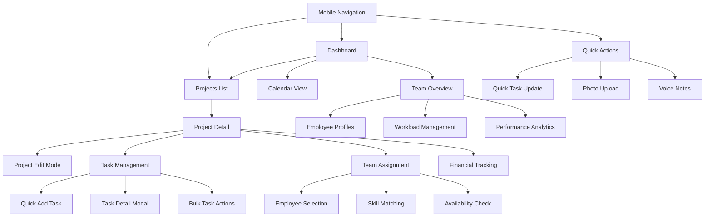

# Smart Home Integrator Project Management System - UI/UX Specification

## Introduction

This document defines the user experience goals, information architecture, user flows, and visual design specifications for a comprehensive project management system specifically designed for smart home integration companies. The system prioritizes speed, flexibility, and ease of use for busy project managers who need to efficiently manage projects, tasks, and team assignments across desktop and mobile devices.

- **Link to Primary Design Files:** [To be created in Figma/Design Tool]
- **Link to Deployed Storybook / Design System:** [To be developed]

## Overall UX Goals & Principles

### Target User Personas

**Primary User: Smart Home Integration Project Manager**
- **Demographics:** 28-45 years old, tech-savvy professionals
- **Context:** Manages 5-15 active projects, travels between job sites, uses mobile devices frequently
- **Goals:** Complete project updates quickly, assign team efficiently, track progress in real-time
- **Pain Points:** Slow interfaces, too many clicks, poor mobile experience, rigid workflows
- **Success Metrics:** Reduce task completion time by 70%, increase mobile usage by 300%

**Secondary User: Field Technician/Installer**
- **Demographics:** 25-40 years old, hands-on technical professionals  
- **Context:** Works on-site, needs quick task updates, limited time for data entry
- **Goals:** Mark tasks complete, report issues, view project details
- **Pain Points:** Complex interfaces, hard to use with gloves, poor offline support

### Usability Goals

1. **Speed & Efficiency:** Common tasks completed in ≤3 clicks/taps
2. **Learn-ability:** New users productive within 10 minutes
3. **Error Prevention:** Minimize data loss with auto-save and validation
4. **Mobile-First:** Optimized for tablet use in field conditions
5. **Accessibility:** WCAG 2.1 AA compliant for inclusive use

### Core Design Principles

1. **"Touch-First, Click-Second"** - Design for fingers first, optimize for mouse second
2. **"Show, Don't Navigate"** - Display information inline rather than requiring navigation
3. **"Progressive Disclosure"** - Show essential info first, advanced options on demand
4. **"Immediate Feedback"** - Provide instant visual confirmation for all user actions
5. **"Graceful Degradation"** - Maintain core functionality even with poor connectivity

## Information Architecture (IA)

### Site Map / Screen Inventory



### Navigation Structure

**Desktop Primary Navigation:**
- Top navigation bar: Dashboard | Projects | Team | Calendar | Reports
- Context-sensitive breadcrumbs
- Quick action floating button (bottom-right)

**Mobile Navigation:**
- Bottom tab bar: Dashboard | Projects | Tasks | Team
- Hamburger menu for secondary features
- Persistent floating action button for quick task creation

**Secondary Navigation:**
- Project detail tabs: Overview | Tasks | Team | Timeline | Files | Budget
- Filter and sort controls in list views
- Context menus for quick actions

## User Flows

### Flow 1: Quick Project Update (Primary Use Case)

**Goal:** PM needs to update project timeline and add urgent tasks while on job site

**Steps:**
```mermaid
graph TD
    Start[PM arrives at job site] --> Open[Open app on tablet]
    Open --> Navigate[Tap project from dashboard]
    Navigate --> Review[Review current status]
    Review --> Edit[Tap "Edit Project" toggle]
    Edit --> Update1[Click end date field]
    Update1 --> DatePicker[Select new date from picker]
    DatePicker --> Update2[Click "Add Task" button]
    Update2 --> TaskForm[Fill task: "Install bedroom speakers"]
    TaskForm --> Assign[Assign to "Mike - Audio Tech"]
    Assign --> Priority[Set priority to "High"]
    Priority --> Save[Auto-save confirms changes]
    Save --> Complete[Continue with inspection]
```

**Success Criteria:** Entire flow completed in <2 minutes

### Flow 2: Daily Task Management (Morning Routine)

**Goal:** PM reviews and adjusts team tasks for the day

**Steps:**
```mermaid
graph TD
    Start[PM starts workday] --> Dashboard[Open dashboard]
    Dashboard --> TaskView[Switch to "Today's Tasks" view]
    TaskView --> Filter[Filter by "My Team"]
    Filter --> Review[Scan overdue tasks (red indicators)]
    Review --> Adjust1[Drag high-priority task to top]
    Adjust1 --> Reassign[Reassign blocked task to available tech]
    Reassign --> NewTask[Add urgent customer request task]
    NewTask --> Notify[System sends notifications to team]
    Notify --> Complete[Ready for day]
```

### Flow 3: Employee Assignment with Skill Matching

**Goal:** Assign team member to project based on required skills

**Steps:**
```mermaid
graph TD
    Start[Need to assign team member] --> Project[Open project detail]
    Project --> Team[Click "Team" tab]
    Team --> Add[Click "Add Team Member"]
    Add --> Skills[System shows required skills: Control4, Network]
    Skills --> Suggest[System suggests 3 matching employees]
    Suggest --> Compare[Compare availability calendars]
    Compare --> Select[Select "Sarah - Control4 Certified"]
    Select --> Role[Assign role: "Lead Installer"]
    Role --> Confirm[Confirm assignment]
    Confirm --> Notify[Sarah receives notification]
```

### Flow 4: Mobile Task Update in Field

**Goal:** Technician updates task progress and reports issue while working

**Steps:**
```mermaid
graph TD
    Start[Tech completes installation step] --> Phone[Pull out phone]
    Phone --> QuickAccess[Use quick action widget]
    QuickAccess --> Current[View current task]
    Current --> Progress[Update progress to 75%]
    Progress --> Issue[Report issue: "Need additional cable"]
    Issue --> Photo[Take photo of wiring]
    Photo --> Voice[Add voice note with details]
    Voice --> Submit[Submit update]
    Submit --> PM[PM receives real-time notification]
```

## Wireframes & Mockups Strategy

### Key Screen Layouts

**1. Project Detail Page (Desktop) - View Mode**
- Header: Project name, status badge, edit toggle, quick actions
- Left panel: Key metrics (timeline, budget, progress)
- Center: Task list with inline actions
- Right panel: Team assignments and recent activity

**2. Project Detail Page (Desktop) - Edit Mode**
- Same layout with editable fields highlighted
- Inline editing with click-to-edit functionality
- Save/cancel controls prominent but not obstructive
- Real-time validation feedback

**3. Mobile Project Detail**
- Stacked vertical layout
- Collapsible sections for different data types
- Large touch targets (minimum 44px)
- Swipe gestures for common actions

**4. Task Management Interface**
- Kanban-style columns for task status
- Quick add task at top of each column
- Drag-and-drop between status columns
- Bulk selection with floating action bar

**5. Employee Assignment Modal**
- Search/filter at top
- Employee cards with skill badges
- Availability indicators (green/yellow/red)
- Quick assignment with role selection

## Component Library / Design System Approach

### Foundational Components

**Interactive Elements:**
- **Button States:** Default, hover, active, disabled, loading
- **Form Controls:** Text input, dropdown, date picker, toggle switch
- **Selection:** Checkbox, radio button, multi-select chips

**Layout Components:**
- **Cards:** Project card, task card, employee card with consistent shadows
- **Modals:** Overlay, drawer, popover with proper focus management
- **Navigation:** Tab bar, breadcrumbs, pagination

**Feedback Components:**
- **Status Indicators:** Progress bars, status badges, loading spinners
- **Notifications:** Toast messages, inline alerts, system notifications
- **Empty States:** Helpful guidance when no data exists

### Interaction Patterns

**Touch Gestures:**
- Swipe right on task: Mark complete
- Swipe left on task: Edit or delete
- Long press: Multi-select mode
- Pull to refresh: Update data

**Keyboard Shortcuts:**
- Ctrl/Cmd + N: New task
- Ctrl/Cmd + E: Edit mode
- Ctrl/Cmd + S: Save changes
- Esc: Cancel/close modal

## Branding & Style Guide

### Color Palette
- **Primary Blue:** #2563EB (trust, professionalism)
- **Success Green:** #059669 (completed tasks, positive feedback)
- **Warning Orange:** #D97706 (attention needed, overdue items)
- **Error Red:** #DC2626 (critical issues, validation errors)
- **Neutral Gray:** #6B7280 (secondary text, borders)
- **Background:** #F9FAFB (main background, clean workspace)

### Typography
- **Primary Font:** Inter (clean, readable, tech-forward)
- **Headings:** Inter Bold (24px, 20px, 18px, 16px)
- **Body Text:** Inter Regular (16px desktop, 18px mobile)
- **Small Text:** Inter Medium (14px labels, 12px metadata)

### Spacing & Grid
- **Base Unit:** 8px spacing system
- **Grid:** 12-column responsive grid
- **Margins:** 16px mobile, 24px tablet, 32px desktop
- **Component Padding:** 12px small, 16px medium, 24px large

## Accessibility (AX) Requirements

### Target Compliance
- **Standard:** WCAG 2.1 AA compliance
- **Color Contrast:** Minimum 4.5:1 for normal text, 3:1 for large text
- **Touch Targets:** Minimum 44px x 44px on mobile devices

### Specific Requirements
- **Keyboard Navigation:** Full keyboard accessibility with visible focus indicators
- **Screen Reader Support:** Proper ARIA labels and landmarks
- **Voice Control:** Compatible with voice navigation systems
- **Motion Preferences:** Respect prefers-reduced-motion settings
- **High Contrast Mode:** Maintain usability in high contrast mode

### Field-Specific Considerations
- **Glove-Friendly:** Controls work with work gloves
- **Sun Readability:** High contrast mode for outdoor use
- **One-Handed Use:** All critical functions accessible with thumb

## Responsiveness Strategy

### Breakpoints
- **Mobile:** 320px - 767px (phone-first design)
- **Tablet:** 768px - 1023px (field tablet optimization)
- **Desktop:** 1024px+ (office workstation)

### Adaptation Strategy

**Mobile (320-767px):**
- Single column layout
- Bottom navigation tabs
- Collapsible sections
- Full-screen modals
- Gesture-based interactions

**Tablet (768-1023px):**
- Two-column layout with sidebar
- Modal overlays instead of full-screen
- Hover states for mouse/trackpad users
- Optimized for landscape orientation

**Desktop (1024px+):**
- Multi-column dashboard layouts
- Hover interactions and tooltips
- Keyboard shortcuts prominently featured
- Dense information display with proper hierarchy

### Performance Considerations
- **Critical Path:** Load project list and basic navigation first
- **Progressive Loading:** Load detailed data as user navigates
- **Offline Support:** Cache recent projects for offline viewing
- **Image Optimization:** Compress and lazy-load project photos

## Advanced Features for Power Users

### Customization Options
- **Dashboard Widgets:** Customizable project overview panels
- **Default Views:** Save preferred filters and sorting
- **Quick Actions:** Customizable floating action button
- **Notification Preferences:** Granular control over alerts

### Integration Capabilities
- **Calendar Sync:** Integration with Google/Outlook calendars
- **File Attachments:** Support for photos, PDFs, CAD files
- **Communication:** Direct integration with team messaging
- **Reporting:** Export capabilities for client presentations

## Detailed Wireframe Specifications

### 1. Dashboard Page (Desktop Layout)

**ASCII Wireframe:**
```
┌─────────────────────────────────────────────────────────────────────────────┐
│ Logo    Dashboard | Projects | Team | Calendar | Reports    [Profile] [🔔] │
├─────────────────────────────────────────────────────────────────────────────┤
│                                                                             │
│ ┌─── Quick Stats ──────────────────┐  ┌─── Today's Priority ─────────────┐ │
│ │ Active Projects: 12              │  │ ⚠️  Wilson Install - Overdue     │ │
│ │ Tasks Due Today: 8               │  │ 🔥  Martinez Audio - High Prio   │ │
│ │ Team Utilization: 85%            │  │ ⏰  Chen Network - Due 2PM       │ │
│ │ This Week Revenue: $45,250       │  │ [+ Add Task]                    │ │
│ └──────────────────────────────────┘  └───────────────────────────────────┘ │
│                                                                             │
│ ┌─── Recent Projects ──────────────────────────────────────────────────────┐ │
│ │ 🟢 Johnson Smart Home    📅 In Progress    👥 3 team    💰 $12,500     │ │
│ │    ████████████░░░░░░░░░░ 75% Complete                                  │ │
│ │    Next: Install living room speakers (Due: Today 3PM)                 │ │
│ │                                                              [View] [Edit] │ │
│ ├─────────────────────────────────────────────────────────────────────────┤ │
│ │ 🟡 Wilson Whole House    📅 Delayed       👥 2 team    💰 $8,900      │ │
│ │    ██████░░░░░░░░░░░░░░░░ 45% Complete                                  │ │
│ │    Blocked: Awaiting electrical rough-in                               │ │
│ │                                                              [View] [Edit] │ │
│ └─────────────────────────────────────────────────────────────────────────┘ │
│                                                                      [🔄] │
└─────────────────────────────────────────────────────────────────────────────┘
```

**Component Specifications:**
- **Header:** 64px height, sticky navigation
- **Quick Stats:** 4-column responsive grid, 240px width cards
- **Project Cards:** Full width, 120px height, hover elevation
- **Progress Bars:** 8px height, smooth animations
- **Action Buttons:** 32px height, primary blue theme

### 2. Project Detail - Edit Mode (Desktop)

**ASCII Wireframe:**
```
┌─────────────────────────────────────────────────────────────────────────────┐
│ ← Projects > Johnson Smart Home                          [Save] [Cancel]   │
├─────────────────────────────────────────────────────────────────────────────┤
│ 📝 EDIT MODE ACTIVE                    ⚠️ Auto-saving...  💾 Saved 2s ago │
│                                                                             │
│ ┌─── Project Details (Editable) ──────────────────────────────────────────┐ │
│ │ Project Name: [Johnson Smart Home                    ]                  │ │
│ │ Customer:     [Johnson Family                        ]                  │ │
│ │ Property:     [123 Maple St, Austin TX               ]                  │ │
│ │ Start Date:   [📅 Jan 15, 2024] End: [📅 Feb 28, 2024]                │ │
│ │ Contract:     [$12,500.00] Status: [In Progress ▼]                     │ │
│ │ Priority:     [Standard ▼]    Type: [Whole Home ▼]                     │ │
│ │                                                                         │ │
│ │ Description:                                                            │ │
│ │ [Complete smart home integration including Control4 system,             │ │
│ │  Lutron lighting, Sonos audio, and security cameras.                   │ │
│ │  Customer wants voice control and mobile app access.            ]       │ │
│ │                                                                         │ │
│ │ ┌─ Budget Breakdown ─────────────────────────────────────────────────┐ │ │
│ │ │ Equipment:  [$8,500.00] Labor: [$3,200.00] Misc: [$800.00]       │ │ │
│ │ │ Spent:      [$8,750.00] Remaining: [$3,750.00]                   │ │ │
│ │ │ ████████████████░░░░░░░░ 70% of budget used                       │ │ │
│ │ └─────────────────────────────────────────────────────────────────────┘ │ │
│ └─────────────────────────────────────────────────────────────────────────┘ │
└─────────────────────────────────────────────────────────────────────────────┘
```

**Edit Mode Features:**
- **Field Highlighting:** Blue borders on active fields
- **Auto-save:** Every 3 seconds with visual confirmation
- **Validation:** Real-time error checking with red indicators
- **Cancel Protection:** Confirmation dialog for unsaved changes

### 3. Task Management - Kanban Interface

**ASCII Wireframe:**
```
┌─────────────────────────────────────────────────────────────────────────────┐
│ Tasks: Johnson Smart Home    [+ Add] [Bulk] [Filter] [Assign] [Due Date]   │
├─────────────────────────────────────────────────────────────────────────────┤
│                                                                             │
│ ┌─ Not Started ──────────┐ ┌─ In Progress ──────────┐ ┌─ Complete ────────┐ │
│ │ [+ Add Task]           │ │ [+ Add Task]           │ │                    │ │
│ │                        │ │                        │ │                    │ │
│ │ ┌─ Install bedroom ───┐ │ │ ┌─ Configure Control4 ┐ │ │ ┌─ Site survey ──┐ │ │
│ │ │   speakers    🔥     │ │ │ │   main system      │ │ │ │   and planning │ │ │
│ │ │ 👤 Mike - Audio      │ │ │ │ 👤 Sarah - PM      │ │ │ │ 👤 Mike - PM   │ │ │
│ │ │ 📅 Today 3PM         │ │ │ │ 📅 Today 5PM       │ │ │ │ ✅ Jan 15      │ │ │
│ │ │ 🕐 Est: 2hrs         │ │ │ │ ⚠️ Issue reported   │ │ │ │ ⭐ 4.8 rating  │ │ │
│ │ │ [Edit] [▶️ Start]     │ │ │ │ 🕐 4hrs remaining   │ │ │ │ [View Details]  │ │ │
│ │ └────────────────────┘ │ │ │ ████████████░░░░░░░ │ │ │ │                │ │ │
│ │                        │ │ │ 75% Complete        │ │ │ │                │ │ │
│ │ ┌─ Install living ───┐ │ │ │ [Edit] [❌ Block]    │ │ │ │                │ │ │
│ │ │   room speakers     │ │ │ └────────────────────┘ │ │ └────────────────┘ │ │
│ │ │ 👤 Tom - Audio      │ │ │                        │ │                    │ │
│ │ │ 📅 Tomorrow         │ │ │ ┌─ Network testing ──┐ │ │ ┌─ Equipment ────┐ │ │
│ │ │ 🟡 Medium Priority  │ │ │ │   and validation   │ │ │ │   delivery     │ │ │
│ │ │ 🕐 Est: 3hrs        │ │ │ │ 👤 Sarah - Network │ │ │ │ 👤 Vendor      │ │ │
│ │ │ [Edit] [▶️ Start]    │ │ │ │ 📅 Feb 1           │ │ │ │ ✅ Jan 18      │ │ │
│ │ └────────────────────┘ │ │ │ 🟢 On Track        │ │ │ │ [Photos] [Docs] │ │ │
│ │                        │ │ │ [Edit] [✅ Complete] │ │ │ └────────────────┘ │ │
│ │                        │ │ └────────────────────┘ │ │                    │ │
│ └────────────────────────┘ └────────────────────────┘ └────────────────────┘ │
└─────────────────────────────────────────────────────────────────────────────┘
```

**Kanban Specifications:**
- **Column Width:** 280px minimum, responsive
- **Card Size:** 140px minimum height
- **Drag & Drop:** Visual feedback during drag operations
- **Status Colors:** Red (overdue), Orange (due soon), Green (on track)
- **Bulk Actions:** Multi-select with shift+click

### 4. Mobile Project View (Phone Portrait)

**ASCII Wireframe:**
```
┌─────────────────────────────┐
│ ← Johnson Smart Home    ⋮   │
├─────────────────────────────┤
│                             │
│ 🟢 In Progress             │
│ Updated: 2 hours ago        │
│                             │
│ ┌─ Overview ───────────────┐ │
│ │ Progress: 75%           │ │
│ │ ████████████░░░░░       │ │
│ │                         │ │
│ │ 📅 Due: Feb 28, 2024    │ │
│ │ 💰 $8,750 / $12,500     │ │
│ │ 👥 3 team members       │ │
│ │                         │ │
│ │ Johnson Family          │ │
│ │ 123 Maple St, Austin    │ │
│ │ [📞 Call] [💬 Message]   │ │
│ └─────────────────────────┘ │
│                             │
│ ┌─ Quick Actions ─────────┐ │
│ │ [+ Add Task]           │ │
│ │ [📝 Update Status]      │ │
│ │ [📷 Add Photos]         │ │
│ │ [🎤 Voice Note]         │ │
│ └─────────────────────────┘ │
│                             │
│ ┌─ Today's Tasks ─────────┐ │
│ │ ⚠️ Install bedroom      │ │
│ │    speakers (Overdue)   │ │
│ │    👤 Mike 🕐 2hrs      │ │
│ │    [▶️ Start] [✅ Done]  │ │
│ │                         │ │
│ │ 🔥 Configure Control4   │ │
│ │    main system          │ │
│ │    👤 Sarah 🕐 4hrs     │ │
│ │    [▶️ Start] [✅ Done]  │ │
│ │                         │ │
│ │ [View All 12 Tasks]     │ │
│ └─────────────────────────┘ │
│                             │
│ [Dashboard][Projects][Tasks][Team] │
└─────────────────────────────┘
```

**Mobile Specifications:**
- **Touch Targets:** 44px minimum height
- **Gestures:** Swipe left for quick actions
- **Bottom Nav:** 56px height, persistent
- **Sections:** Collapsible with smooth animations

### 5. Employee Assignment Modal

**ASCII Wireframe:**
```
┌─────────────────────────────────────────────────────────────────────────────┐
│                     Assign Team Member                         [✕]         │
├─────────────────────────────────────────────────────────────────────────────┤
│ Project: Johnson Smart Home | Required: Control4, Network, Audio            │
│                                                                             │
│ ┌─ Search & Filter ──────────────────────────────────────────────────────┐ │
│ │ [🔍 Search employees...      ] [Skills ▼] [Available ▼] [Rate ▼]       │ │
│ └─────────────────────────────────────────────────────────────────────────┘ │
│                                                                             │
│ ┌─ Suggested Matches ────────────────────────────────────────────────────┐ │
│ │ ┌─ Sarah Williams ─────────┐  ┌─ Mike Chen ──────────────┐  ┌─ Tom ────┐ │ │
│ │ │ Lead Installer           │  │ Project Manager          │  │ Audio    │ │ │
│ │ │ ⭐ 4.9 rating (127 jobs) │  │ ⭐ 4.7 rating (89 jobs)  │  │ Specialist│ │ │
│ │ │                          │  │                          │  │ ⭐ 4.8   │ │ │
│ │ │ Skills: ✅ Control4      │  │ Skills: ✅ Control4      │  │ (45 jobs) │ │ │
│ │ │         ✅ Network       │  │         ✅ Network       │  │          │ │ │
│ │ │         ✅ Audio         │  │         ❌ Audio         │  │ Skills:  │ │ │
│ │ │         ✅ Security      │  │         ✅ Security      │  │ ✅ Audio │ │ │
│ │ │                          │  │         ✅ Project Mgmt  │  │ ❌ Network │ │ │
│ │ │ 🟢 Available Now         │  │                          │  │ ❌ Control4│ │ │
│ │ │ Capacity: 75% (2/3 proj) │  │ 🟡 Busy until 3PM       │  │          │ │ │
│ │ │ Rate: $85/hr             │  │ Capacity: 100% (3/3)     │  │ 🟢 Available │ │ │
│ │ │                          │  │ Rate: $95/hr             │  │ Capacity: 33%│ │ │
│ │ │ [✅ Select]              │  │ [⏰ Schedule Later]      │  │ Rate: $75/hr │ │ │
│ │ └──────────────────────────┘  └──────────────────────────┘  │          │ │ │
│ │                                                             │ [✅ Select] │ │ │
│ │                                                             └──────────┘ │ │
│ └─────────────────────────────────────────────────────────────────────────┘ │
│                                                                             │
│ ┌─ Assignment Details ───────────────────────────────────────────────────┐ │
│ │ Selected: Sarah Williams                                                │ │
│ │ Role: [Lead Installer ▼] Start: [📅 Today] Hours: [40]                 │ │
│ │ Rate: [$85.00/hr] Notify: [✅] Email [✅] SMS [✅] Push                 │ │
│ │ Notes: [Sarah has prior Control4 experience with this customer    ]     │ │
│ └─────────────────────────────────────────────────────────────────────────┘ │
│                                                                             │
│                                         [Cancel] [Assign to Project]       │
└─────────────────────────────────────────────────────────────────────────────┘
```

**Modal Specifications:**
- **Size:** 800px × 600px, responsive
- **Employee Cards:** 240px width, skill badges
- **Availability:** Real-time status indicators
- **Skill Matching:** Visual compatibility scoring

## Interactive Behavior Specifications

### Click/Tap Interactions
- **Single Click:** Select, activate, navigate to detail view
- **Double Click:** Quick edit mode for text fields (desktop)
- **Long Press (Mobile):** Context menu or multi-select mode
- **Hover (Desktop):** Show tooltips, reveal action buttons
- **Right Click:** Context menu for power users

### Form Validation & Feedback
- **Real-time Validation:** Show errors as user types, green checkmarks for valid fields
- **Required Fields:** Red asterisk indicator, red border when empty
- **Format Validation:** Email, phone, currency with inline feedback messages
- **Save State:** Auto-save with visual confirmation, "Saving..." indicator
- **Error Recovery:** Clear error messages with helpful correction suggestions

### Loading & State Management
- **Page Loading:** Skeleton screens for smooth perceived performance
- **Action Feedback:** Button loading spinners, success animations (checkmarks)
- **Error States:** Toast notifications with retry options, persistent for critical errors
- **Empty States:** Helpful guidance with clear call-to-action buttons
- **Offline Mode:** Clear indicators, cached data access, sync when reconnected

### Gesture Support (Mobile)
- **Swipe Right:** Mark task complete, archive project
- **Swipe Left:** Quick edit, delete with confirmation
- **Pull to Refresh:** Update project data, refresh task lists
- **Pinch to Zoom:** Image viewers, detailed timeline views
- **Long Press:** Multi-select mode for bulk actions

## Responsive Breakpoint Behaviors

### Mobile (320-767px)
- **Layout:** Single column stack, full-width cards
- **Navigation:** Bottom tab bar, hamburger for secondary features
- **Modals:** Full-screen overlays, slide-up animations
- **Touch Targets:** 44px minimum, generous spacing
- **Text Size:** 18px body text for readability

### Tablet (768-1023px)
- **Layout:** Two-column with collapsible sidebar
- **Navigation:** Top bar with secondary tabs
- **Modals:** Overlay style, 80% screen width maximum
- **Touch Targets:** 40px minimum, optimized for finger use
- **Orientation:** Landscape-optimized layouts

### Desktop (1024px+)
- **Layout:** Multi-column dashboards, sidebar navigation
- **Navigation:** Full horizontal menu, persistent breadcrumbs
- **Modals:** Centered overlays, backdrop blur effects
- **Interactions:** Hover states, keyboard shortcuts prominent
- **Density:** Higher information density with proper hierarchy

---

## Implementation Notes for Development Teams

### Critical Performance Requirements
- **First Contentful Paint:** <1.5 seconds on 3G networks
- **Time to Interactive:** <3 seconds for core functionality
- **Task Completion Rate:** 90% success rate within 3 clicks/taps
- **Mobile Performance:** Smooth 60fps on mid-range Android devices
- **Memory Usage:** <50MB baseline, <100MB with media content

### Accessibility Implementation Checklist
- **Keyboard Navigation:** Complete functionality without mouse, visible focus indicators
- **Screen Reader Support:** Comprehensive ARIA labels, landmarks, live regions for updates
- **Color Independence:** Information conveyed through icons, text, patterns beyond color
- **Touch Accessibility:** 44px minimum touch targets, voice control compatibility
- **Motion Preferences:** Respect prefers-reduced-motion, disable animations when requested
- **High Contrast Mode:** Maintain usability in system high contrast settings

### Field-Specific Accessibility
- **Glove Compatibility:** Touch targets work with work gloves, increased spacing
- **Sun Readability:** High contrast mode for outdoor bright light conditions
- **One-Handed Use:** All critical functions reachable with thumb, bottom-heavy layout
- **Voice Input:** Support for hands-free data entry and navigation
- **Offline Robustness:** Core functionality available without network connectivity

### Security & Privacy Considerations
- **Data Protection:** Customer information masked in screenshots, secure data transmission
- **Employee Privacy:** Role-based access to personal information, anonymized analytics
- **Session Management:** Auto-logout for security, graceful session recovery
- **Audit Trails:** Track all project changes, maintain accountability
- **GDPR Compliance:** Data export capabilities, deletion rights, consent management

### Development Implementation Phases

#### Phase 1: Foundation (Weeks 1-3)
**Priority:** Core user flows, basic project management
- Dashboard with project overview cards
- Project detail page (view mode only)
- Basic task list (no drag-and-drop yet)
- Simple employee directory
- Mobile responsive framework

**Success Metrics:**
- Users can view project status
- Project information is accessible
- Basic navigation works on mobile

#### Phase 2: Editing & Interaction (Weeks 4-6)
**Priority:** Inline editing, task management enhancement
- Edit mode toggle for project details
- Inline field editing with auto-save
- Enhanced task management (drag-and-drop)
- Employee assignment basic workflow
- Form validation and error handling

**Success Metrics:**
- Project managers can edit projects quickly
- Task status updates are intuitive
- Team assignment workflow is functional

#### Phase 3: Mobile Optimization (Weeks 7-8)
**Priority:** Mobile-first features, field usability
- Mobile-optimized layouts and touch targets
- Swipe gestures for common actions
- Quick action buttons and shortcuts
- Offline functionality for basic operations
- Photo upload and voice notes

**Success Metrics:**
- Mobile task completion time <50% of desktop
- Field technicians can update status easily
- App works reliably in poor network conditions

#### Phase 4: Advanced Features (Weeks 9-12)
**Priority:** Power user features, integrations
- Advanced filtering and search
- Bulk operations and batch updates
- Calendar integration and scheduling
- Reporting and analytics dashboard
- Performance optimization and polish

**Success Metrics:**
- Power users adopt keyboard shortcuts
- Integration workflows are seamless
- Performance meets all benchmarks

### Technical Architecture Recommendations

#### Frontend Framework
- **React with TypeScript** for type safety and component reusability
- **Next.js** for server-side rendering and performance optimization
- **Tailwind CSS** for consistent, responsive styling
- **Framer Motion** for smooth animations and transitions

#### State Management
- **React Query** for server state and caching
- **Zustand** for client-side state management
- **React Hook Form** for form handling and validation
- **Local Storage** for offline capabilities and user preferences

#### Component Library
- **Headless UI** for accessible component primitives
- **Radix UI** for complex components (modals, dropdowns)
- **React DnD** for drag-and-drop functionality
- **Custom components** for domain-specific widgets

#### Testing Strategy
- **Cypress** for end-to-end user flow testing
- **React Testing Library** for component unit tests
- **Lighthouse CI** for performance regression testing
- **Axe** for automated accessibility testing

---

## Design System Implementation Guide

### Component Hierarchy
```
App Shell
├── Navigation (Header/Sidebar/Mobile Tabs)
├── Main Content Area
│   ├── Page Header (breadcrumbs, actions)
│   ├── Content Sections
│   │   ├── Cards (Project/Task/Employee)
│   │   ├── Tables (Sortable, Filterable)
│   │   ├── Forms (Inline editing, Modals)
│   │   └── Charts (Progress, Analytics)
│   └── Page Footer
└── Global Elements (Notifications, Modals)
```

### Reusable Component Specifications

#### Button Component
```typescript
interface ButtonProps {
  variant: 'primary' | 'secondary' | 'danger' | 'ghost';
  size: 'sm' | 'md' | 'lg';
  loading?: boolean;
  disabled?: boolean;
  icon?: ReactNode;
  children: ReactNode;
  onClick: () => void;
}
```

#### Card Component
```typescript
interface CardProps {
  variant: 'project' | 'task' | 'employee' | 'metric';
  interactive?: boolean;
  loading?: boolean;
  header?: ReactNode;
  footer?: ReactNode;
  children: ReactNode;
}
```

#### Modal Component
```typescript
interface ModalProps {
  isOpen: boolean;
  onClose: () => void;
  size: 'sm' | 'md' | 'lg' | 'xl' | 'fullscreen';
  title: string;
  children: ReactNode;
  footer?: ReactNode;
}
```

This comprehensive wireframe specification provides the detailed foundation needed for development teams to build the most user-friendly project management system specifically designed for smart home integrators' daily workflow needs.

---

## Change Log

| Change | Date | Version | Description | Author |
|--------|------|---------|-------------|--------|
| Initial Creation | Current | 1.0 | Complete UI/UX specification with detailed wireframes | Karen - Design Architect |